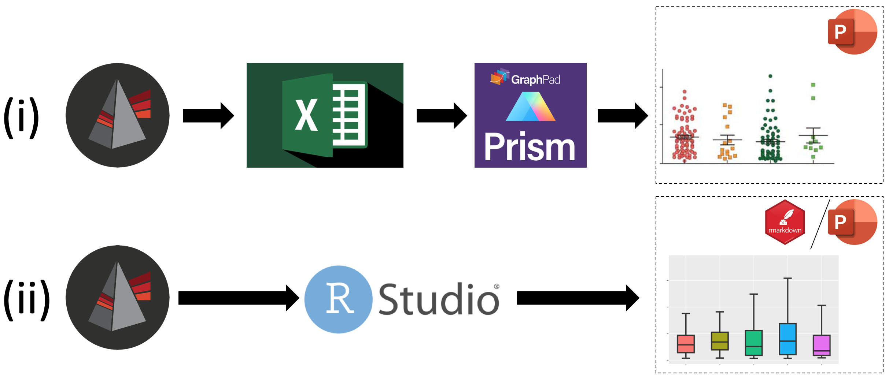

<!-- README.md is generated from README.Rmd. Please edit that file -->

```{r, include = FALSE}
knitr::opts_chunk$set(
  collapse = TRUE,
  comment = "#>",
  fig.path = "man/figures/README-",
  out.width = "100%"
)
```

# fcexpr

<!-- badges: start -->
<!-- badges: end -->

Complement your [FlowJo](https://www.flowjo.com)-based analysis of flow cytometric experiments.

## Installation

Install fcexpr from GitHub. This requires devtools.
``` r
install.packages("devtools")
devtools::install_github("Close-your-eyes/fcexpr")
```

## The idea
FlowJo is, for many people in science, **the** tool to gate, explore and evaluate flow cytometric data. Other commercial software may also be convenient though.
When it comes to statistical analysis of gated data one has to export or copy aggregated values or statistics from FlowJo (MFIs, cell counts, frequencies, etc).
to other software. With a workflow like (i) (see below) it is  
1) inconvenient to manually copy and arrange the data  
2) inefficient with respect to labor time  
3) laborious to maintain all meta data throughout the different softwares  
4) problematic with respect to reproducibility (manual clicking, dragging and dropping is not traceable)  
5) not scalable to many samples or to problems where the exact read-out parameter is unknown yet  
6) not dynamic if you decide to change the gating strategy or position of gates.  
  
**So, I want to make a plea for workflow (ii) and provide functions to easily accomplish it.**  
  
The concept of the fcexpr-package is derived from a flow-user perspective and may exactly suit what you need to organize your flow experiments in a consistent way.
It will make it convenient to create a merged data frame of statistics from the flowjo workspace and meta data describing what the fcs files represent. Such data frame may then be subject to common procedures of tidying and plotting data with tools from the [tidyverse](https://www.tidyverse.org) or just base R.

**In comparison to other packages, values from flowjo workspaces can be read independent from the underlying fcs files. That means one may prepare plots and make statistical analyses independent of a flowjo-dongle once the gating has been conducted.**



## How to start

You may adopt the whole concept of organizing flow cytometric experiments by creating a default folder as follows.
``` r
fcexpr::new_exp(path = "my_path", name = "my_folder_name")
```
Then copy your fcs files to the FCS_files folder and see the vignette below of how to set up a meta data table (sampledescription).

Alternatively, you may only be interested in obtaining the statistics from your flowjo workspace, then use:
``` r
# read data from .wsp-file independent of FCS files
ps <- fcexpr::wsx_get_popstats(ws = "myfolder/my.wsp")
# get population counts
ps_counts <- ps[[1]]
# get statistics, like MFIs
ps_stats <- ps[[2]]
# save to excel
openxlsx::write.xlsx(x = ps_counts, file = "myfolder/my_counts.xlsx")
# or to an open format
write.table(x = ps_counts, file = "myfolder/my_counts.tsv", sep = "\t", row.names = F)
```

## Vignettes or tutorials
  
[import data from flowjo workspaces](https://close-your-eyes.github.io/fcexpr/articles/import_data_from_fj_workspaces.html)  
[import data from flowjo workspaces on youtube](https://www.youtube.com/watch?v=0yyfH_XqC2Q)  
[maintain a sampledescription; comes with a bit of flavour](https://www.youtube.com/watch?v=mZWZk4jVjas)


