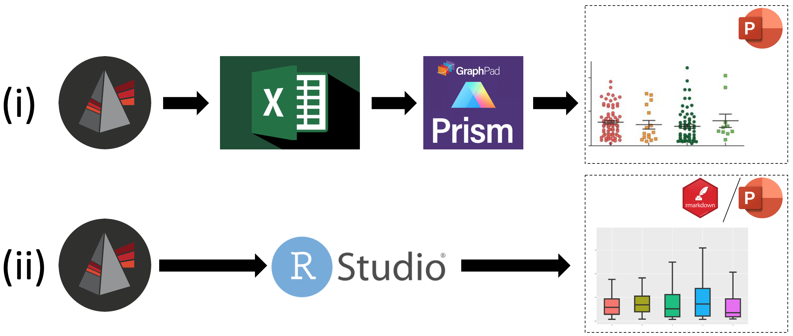

<!-- README.md is generated from README.Rmd. Please edit that file -->

# fcexpr

<!-- badges: start -->
<!-- badges: end -->

A set of functions to organize and analyze flow cytometry experiments in
R and to overcome a few limitations from FlowJo.

## Installation

Please install optional packages from bioconductor. Some functions can
be used without them though.

``` r
install.packages("BiocManager")
BiocManager::install("flowCore")
BiocManager::install("flowWorkspace")
BiocManager::install("CytoML")
```

Please install fcexpr from GitHub. This requires devtools.

``` r
install.packages("devtools")
devtools::install_github("Close-your-eyes/fcexpr")
```

## The idea

FlowJo is, for many people working in science, **the** tool to gate,
explore and evaluate flow cytometric data. Other commercial software may
also be convenient though. When it comes to statistical analysis of
gated data one has to export or copy aggregated values or statistics
from FlowJo (MFIs, cell counts, frequencies, etc). to other software. If
a workflow like (i) (see below) is employed, it is  
1) inconvenient to manually copy and arrange the data  
2) inefficient with respect to labor time  
3) laborious to maintain all meta data throughout the different
softwares  
4) problematic with respect to reproducibility (manual clicking,
dragging and dropping is not traceable)  
5) not scalable to many samples or to problems where the exact read-out
parameter is unknown yet  
6) not easily adjustable if you decide to change the gating strategy or
position of gates.

**So, I want to make a plea for workflow (ii) and provide tools to
easily accomplish it.**

The suggested concept of the fcexpr-package is actually not a major
deal. It is 100 % derived though from a user-perspective and may exactly
suit what you need to organize your flow experiments in a consistent
way. It will make it convenient to create a merged data frame of
statistics directly from the flowjo workspace and meta data describing
what the fcs files represent. Such data frame may then be subject to
common procedures of tidying and plotting data with tools from the
[tidyverse](https://www.tidyverse.org).

**In comparison to other packages, values from flowjo workspaces can be
read totally independent from fcs files. That means one may prepare
plots and statistical analysis at home and/or independent of a
flowjo-dongle once the gating has been conducted.**



## How to start

You may adopt the whole concept of organizing flow cytometric
experiments by creating a default folder as follows.

``` r
fcexpr::new_exp(path = "my_path", name = "my_folder_name")
```

Then copy your fcs files to the respect folder and see the vignette
below of how to document (synchronize) them with a sampledescription
file.

Alternatively, you may only be interested in obtaining the statistics
from your flowjo workspace, then use:

``` r
fcexpr::wsx_get_popstats(ws = "myfolder/my.wsp")
```

## Vignettes (tutorials)

[synchronize FCS files and
sampledescription](https://close-your-eyes.github.io/fcexpr/articles/synchronizing_FCS_files_with_an_xlsx_file.html)  
[import data from flowjo
workspaces](https://close-your-eyes.github.io/fcexpr/articles/import_data_from_fj_workspaces.html)
